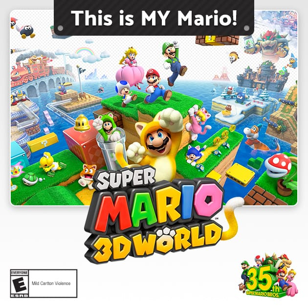

## Welcome to my Github page!


## Hello world!



### Markdown

```markdown
# Project 1
## Project 2
### Project 3

- Project 1
- Project 2
- Project 3

1. Project 1
2. Project 2
3. Project 3

**Project 1**
_Project 2_
`Project 3`
```

## Math Equation


## Python Code

```Python
import numpy as np

x = np.sqrt(64)
y = np.sqrt(16)
z = np.sqrt(4)
```
